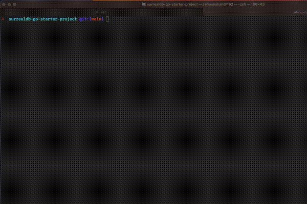

# SurrealDB Go Starter Project
Welcome to the SurrealDB Go Starter Project, a solid foundation for your Go projects powered by SurrealDB.



## Getting Started
To start a new Go project using this template, you can clone or download this repository.

## Development
After you have cloned the repository, you need to set up SurrealDB. 

### TODO: Using Docker
We recommend using Docker, but you can also install SurrealDB directly on your machine.

To set up a Docker container for SurrealDB, run the following command:

```bash
docker compose up -d
```

```bash
docker compose stop # Pauses the container
docker compose down # Tears down the container, wiping data
```


### MacOS

```zsh
brew install surrealdb/tap/surreal
```

```zsh
make dbrun
```

Now, you can start coding and developing your Go project.

## Install Golangci 

Use the following [golang-ci link](https://golangci-lint.run/usage/install/) to install it for your setup

## Running golang-ci

Run `make lint`

## Running tests

Run `make test`

## Running the application

Run `make run`

## Sample Run To Db

```bash
curl --location 'http://0.0.0.0:8080/users' \
--header 'Content-Type: application/json' \
--data '{
    "name": "Ishrat",
    "surname": "Shah"
}'
```

## Contributing
This project is built for Hacktoberfest 2023, and anyone is welcome to contribute or make suggestions on how to enhance this template for Go development with SurrealDB.

Feel free to open pull requests or issues, and I'll review them as soon as possible.

Happy coding with SurrealDB for Go!

## Project Roadmap

TODO: Move to Epic / Wiki soon

- [x] Basic Main function
- [x] Integrate Go HTTP Router
- [x] Integrate simple GET/POST/PUT/DELETE event
- [ ] Integrate DB logic with HTTP Methods
    - [x] Integrate GET Method
    - [x] Integrate POST Method
    - [ ] Integrate PUT Method
    - [ ] Integrate DELETE Method
- [ ] Add data to DB
- [x] Add logging 